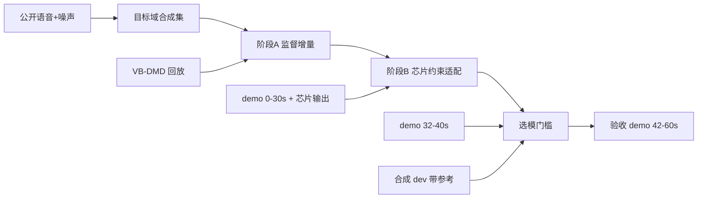

# UL-UNAS 在 demo 上不劣于芯片的增量训练方案

## 目标与验收口径

**目标：** 在 3 个场景上，UL-UNAS 处理 `demo/*降噪前.wav` 的输出都不比同名 `*降噪后.wav`（芯片）差。场景是 75 dB 游戏音乐、85 dB 枪声、90 dB MMO BGM。

**不作弊：** demo 每条约 60 秒，按时间切成三段，中间留保护间隔：

- 0–30 s：训练（teacher 约束）
- 32–40 s：验证（选模、早停）
- 42–60 s：验收（只在最后跑一次）

报告里的通过/不通过只看 42–60 s。全段数字可以附上，但要标注「含训练段」。

**比较前先做响度对齐：** 用全局一个增益，把 student、芯片、noisy 的人声段对到同一 LUFS。不能用逐帧对齐。现有 `remove_slow_gain` 按 400 ms 帧把芯片输出拉回原混音能量，最多放大约 26 dB，会把芯片压下去的背景重新抬上来，而且会奖励「整段变轻」。

**分场景的通过条件：** 3 个场景都要同时满足下面 4 条。

| 维度 | 指标 | 门槛 |
|---|---|---|
| 人声清晰 | DNSMOS P.835 SIG | 不低于芯片 − 0.05 |
| 背景干净 | DNSMOS P.835 BAK | 不低于芯片 |
| 背景干净 | 非语音帧残留电平（响度对齐后，VAD 取自 noisy） | 不高于芯片 |
| 整体 | DNSMOS OVRL，以及盲听 ABX/偏好测试（至少 5 人） | 不低于芯片；盲听偏好不显著劣于芯片 |

SQUIM（torchaudio 无参考 PESQ/STOI 估计）只作参考，不设门槛。

## 第 0 步：验收框架和基线（先做，不训练）

- 修改 [training/align_teacher.py](training/align_teacher.py)：
  - 新增全局增益对齐：只在人声活跃帧算一个增益，保留延迟估计。
  - 旧的 `remove_slow_gain` 保留为选项，默认关闭。
- 新建 [training/split_demo.py](training/split_demo.py)：生成 `demo_train.jsonl`、`demo_val.jsonl`、`demo_test.jsonl`。
  - 每行带 `start_s` / `end_s` / `layer` / `teacher`。
  - 只有 `demo_test` 标 `held_out: true`。
- 修改 [training/dataset.py](training/dataset.py)：
  - `PairDataset` 支持 `start_s` / `end_s`，裁剪只在区间内随机。
  - teacher 与 mix 用同一个起点裁剪。现在 `_fix_len` 对它们各自随机，teacher 会错位。
- 修改 [training/metrics.py](training/metrics.py)：
  - 增加 DNSMOS P.835 onnx 推理（`sig_bak_ovr.onnx`，16 kHz，9 秒窗）。
  - 增加响度对齐后的非语音残留电平（VAD 用 silero-vad 或能量 VAD，基于 noisy 计算）。
  - 增加可选 SQUIM。
- 新建 [training/compare_demo.py](training/compare_demo.py)：
  - 分场景输出 noisy、芯片、DNS3、当前 `finetune_vbdemand/ulunas_finetuned.pt` 和候选模型的表格，以及通过/不通过。
  - 同时导出盲听包：随机命名，响度已对齐。

第 0 步先回答两个问题：现在差芯片多少，差在人声还是背景。后面的权重倾向按这个结论定。

## 第 1 步：目标域合成数据（只用公开数据）

新建 [training/download_public_target.py](training/download_public_target.py)，许可证写进 [training/data/licenses.md](training/data/licenses.md)。

数据来源：

- **噪声：** DNS Challenge noise；FSD50K 的 Gunshot/gunfire、Explosion、Music 子类；MUSAN music。
- **人声：** demo 大概率是中文，所以加 AISHELL-3 或 DNS Challenge clean 的中文部分，同时保留 VCTK。
- **RIR：** OpenSLR 26/28。

扩展 [training/synthesize_pairs.py](training/synthesize_pairs.py) 的 `--mode synth`（或新建 `synth_target.py`），混合规则如下：

- `layer` 取 `game_music` / `gunshot` / `mmo_bgm`，直接复用 `balanced_sampler` 的场景权重。
- SNR 以 demo 为中心：人声 85 dB 对噪声 75/85/90 dB，对应 +10 / 0 / −5 dB，整体在 [−10, +15] dB 内抽样。
- 枪声用稀疏瞬态叠加，峰值 SNR 单独控制。
- 电平增强到 −55 到 −20 dBFS。demo 本身约 −44 dBFS，偏安静。
- 加随机 EQ、RIR 和轻度削波，模拟麦克风链路。
- 另配约 10% 的 `noise_only` 和约 10% 的 `clean_only`。`total_loss` 已经支持这两种，分别用于压背景和保护干净人声。
- 按说话人和噪声文件划分 train / dev（dev 约 1000 条，带干净参考）。

## 第 2 步：阶段 A 监督增量（GPU）

- **初始化：** `training/outputs/finetune_vbdemand/ulunas_finetuned.pt`（VB-DMD 测试集 17.2 dB）。输出放到新目录 `training/outputs/target_stageA/`，避免覆盖。
- **数据：** 目标域合成集约 75%，`train_vbdemand` 回放约 25%，防止遗忘。
- **修改 [training/train_ulunas.py](training/train_ulunas.py)：**
  - 学习率 warmup 加 cosine。
  - 增加 `--replay_ratio`。
  - 默认用 4 秒裁剪，batch 32。
  - 保留 `clip_grad_norm_`。
- **分两段训练：**
  1. 冻结 `decoder_tail`，`lr=1e-5`，约 20k step。
  2. `--freeze full`，`lr=3e-6`，约 10k step。
- **loss：** 沿用 `w_mag=10`、`w_ri=5`、`w_sisnr=1`、`w_prot=2`。`noise_only` 的 `w_noise` 按第 0 步结论调：背景不如芯片就调大，人声不如芯片就先加大 `w_prot`。不要回到 70/30 的幅度权重，那组设置之前塌过。
- **每 1k step 评估一次：** 合成 dev 的 SI-SDR / PESQ，VB-DMD dev，以及 demo_val 的 DNSMOS。

## 第 3 步：阶段 B 芯片约束适配（小步、低学习率）

在 [training/losses.py](training/losses.py) 新增 `teacher_bound_loss`，把芯片输出当作「至少要这么干净」的下限：

- **非语音帧：** 单边约束 `relu(mag_student − mag_teacher)`。只罚比芯片脏的部分，不罚更干净的部分。
- **语音帧：** 低权重的 `mask_distill_loss`（现有），外加 `relu(mask_teacher − mask_student)`，罚比芯片削掉更多人声的部分。
- 语音/非语音帧的划分用 noisy 上的 VAD。

训练设置：

- 数据：约 90% 阶段 A 的数据，约 10% `demo_train` 裁剪，都走 `--use_teacher`。
- `lr=2e-6`，最多 2–3k step，按 demo_val 早停。
- 风险：demo 训练段总共只有约 90 秒，很容易过拟合。所以要保持低学习率、短训练，并保留合成 dev 门槛。

## 第 4 步：选模门槛

把 [training/train_ulunas.py](training/train_ulunas.py) 里只看 SI-SDR 的 `should_write_best` 改成复合门槛。候选要同时满足：

- 合成 dev 的 SI-SDR 和 PESQ 不低于起点。
- VB-DMD dev 的 SI-SDR 下降不超过 0.3 dB。
- demo_val 上每个场景的 SIG、BAK、OVRL 相对芯片的差距比上一版小。

候选里取 demo_val 综合最好的那一个。每个阶段都保留 `ulunas_last.pt`，但它不经过门槛。

## 第 5 步：验收与部署检查

- 用 `compare_demo.py` 在 42–60 s 跑一次，并做盲听。任何一个场景没过，就回到第 0 步看差在哪一维，不要在验收段上反复调参。
- 可选：[training/postfilter.py](training/postfilter.py) 的 `warp_*` 配置在游戏音乐上有小幅 BAK 增益。但只在 SIG 不降、且过门槛时才加。
- 可选：输出端加一个与芯片相当的慢速 AGC。现在 MMO 场景的输出比输入低约 8 dB，电平差会影响主观听感。
- 用 [training/deploy_stream.py](training/deploy_stream.py) 核对流式输出与离线输出一致、RTF 达标。

## 已知限制

- 时间切分的验收段和训练段来自同一段录音、同一个说话人和同一台设备，泛化结论偏弱。条件允许时，补录新的芯片对照音频做最终验收。
- DNSMOS 对枪声这类瞬态噪声不一定可靠，所以盲听必须保留，不能只看数字。